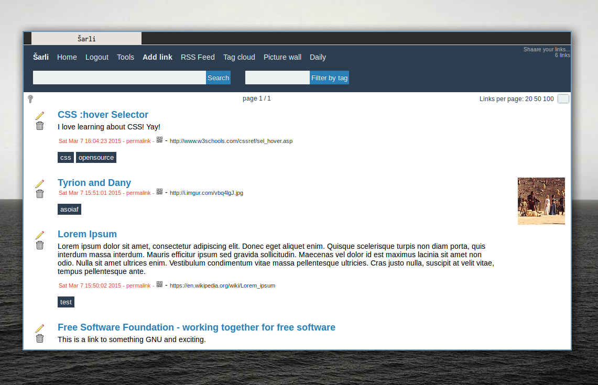

## Shaarli-themes
A collection of themes/stylesheets for [Shaarli](https://github.com/sebsauvage/Shaarli).

#### Serious



Author: Miloš Jovanović
Source https://github.com/mrjovanovic/serious-theme-shaarli
License: Affero GPL v.3

## Usage
```
cd /your/shaarli/directory/inc/
git clone https://github.com/nodiscc/shaarli-themes themes/
#or git submodule add https://github.com/nodiscc/shaarli-themes themes/
cp themes/yourthemename.css user.css
#or ln -s themes/yourthemename.css user.css
```

## More
More info on themes on [Shaarli's wiki](https://github.com/shaarli/Shaarli/wiki#changing-theme)
